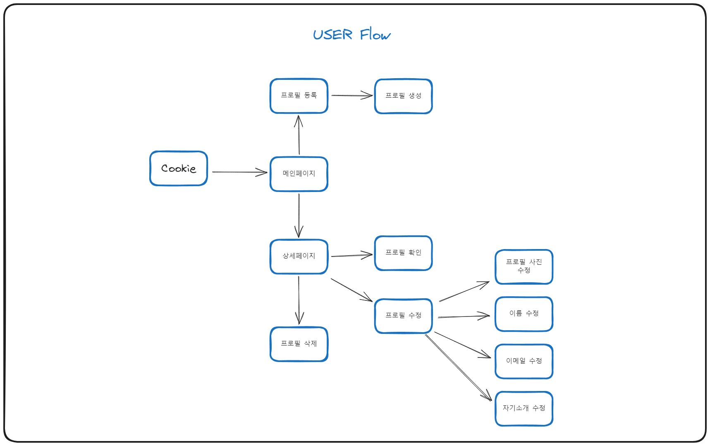

# Cookie 임직원 프로필 등록 관리 서비스

> 개발 기간: 2023-08-08 ~ 2023-08-18  
> 개발 인원: 1명

## 개발 설명

Cookie 임직원 프로필을 등록 수정 확인 삭제가 가능한 웹 페이지입니다.

### 배포 링크

<a href="https://kdt-fe-js-project.vercel.app/">https://kdt-fe-js-project.vercel.app/</a>

### 개발 스택

HTML, SCSS, Javascript, Parcel, Vercel, Firebase

### User flow

### 주요 기능

-   프로필 등록  
    
     
     
     
-   프로필 수정  
    
     
     
     
-   프로필 삭제  
    
     
     
     
-   프로필 검색  
    

## :cat: 필수요구사항

-   [x] “AWS S3 / Firebase 같은 서비스”를 이용하여 사진을 관리할 수 있는 페이지를 구현하세요.
-   [x] 프로필 페이지를 개발하세요.
-   [x] 스크롤이 가능한 형태의 리스팅 페이지를 개발하세요.
-   [x] 전체 페이지 데스크탑-모바일 반응형 페이지를 개발하세요.
-   [x] 사진을 등록, 수정, 삭제가 가능해야 합니다.
-   [x] 유저 플로우를 제작하여 리드미에 추가하세요.
-   [x] CSS 애니메이션 구현
-   [x] CSS 상대수치 사용(rem, em)
-   [x] JS DOM event 조작

## 선택요구사항

-   [ ] 사진 관리 페이지와 관련된 기타 기능도 고려해 보세요.
-   [x] 페이지가 보여지기 전에 로딩 애니메이션이 보이도록 만들어보세요.
-   [x] 직원을 등록, 수정, 삭제가 가능하게 해보세요.
-   [x] 직원 검색 기능을 추가해 보세요.
-   [ ] infinity scroll 기능을 추가해 보세요.
-   [ ] 사진을 편집할 수 있는 기능을 추가해 보세요.
-   [ ] LocalStorage 사용
